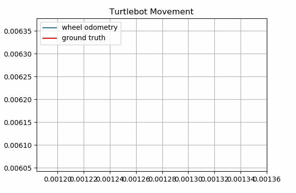
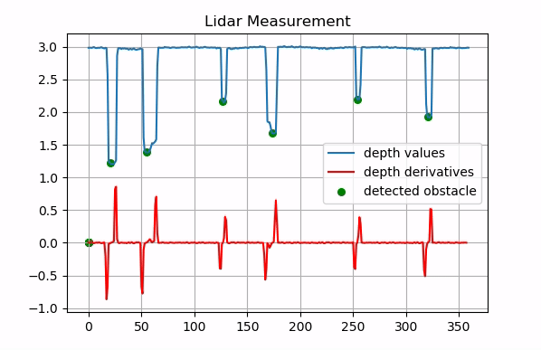
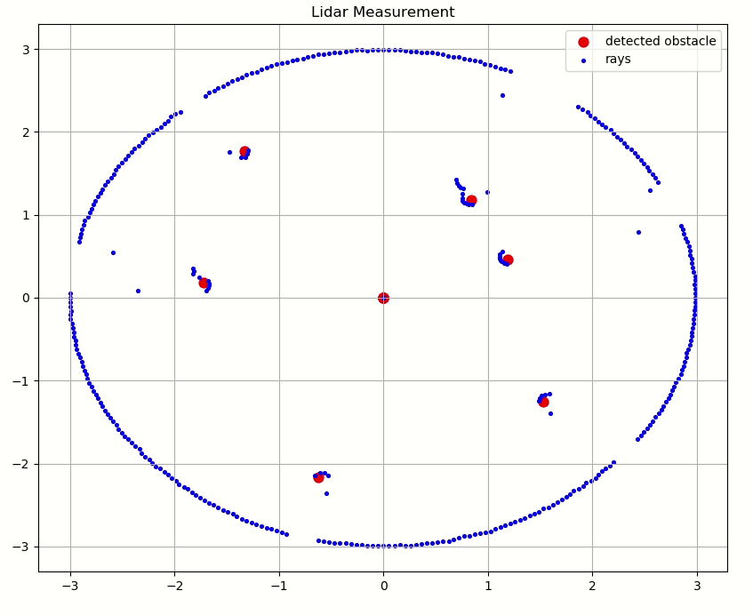

# SLAM
In this repo, I will roughly try to implement the steps followed in Brenner's SLAM course, with C++, on a simple differential drive robot simulation, with Webots.
We'll take the simple motion shown below in Webots as a base for the next steps.

### 1) Measuring pose from wheel tick (Odometry)
Based on the differential drive model of turtlebot, and counting the wheel displacement at each measurement step, we can estimate the pose of the robot. Note that due to small angle approximation in the turn model and due to wheel slip, the pose error is accumulating when we use only wheel encoder as sensors.

### 2) Determining obstacles from lidar depth data
We can equip our robot with a 360 lidar on Webots, which gives a depth measure with 1ray/angle resolution. To determine the relative position of the cylindrical obstacles, we determine the area between each left falling edge and right rising edge, and then determine the average ray number and depth in that region.
 
